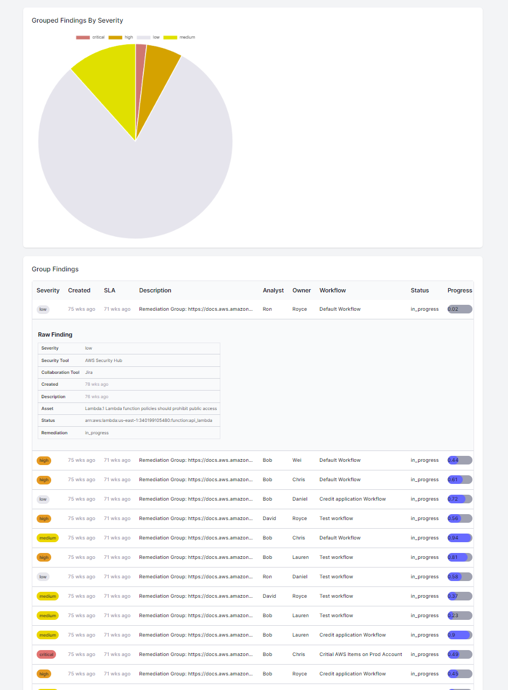

# react-dashboard

This is a quick dashboard project to test out Next13 and FastAPI. This dashboard displays issue severity in a pie chart and lists issue findings in an expandable table.



Frontend:

- Next.js using the Next 13 app directory
- React Query (Tanstack)
- TailwindCSS
- TypeScript

Backend:

- FastAPI
- SQLAlchemy
- SQLite

## Get Started

### Docker

```
docker-compose -f .\docker-compose.yml up -d --build
```

### Manually

- server/README
- frontend/README
